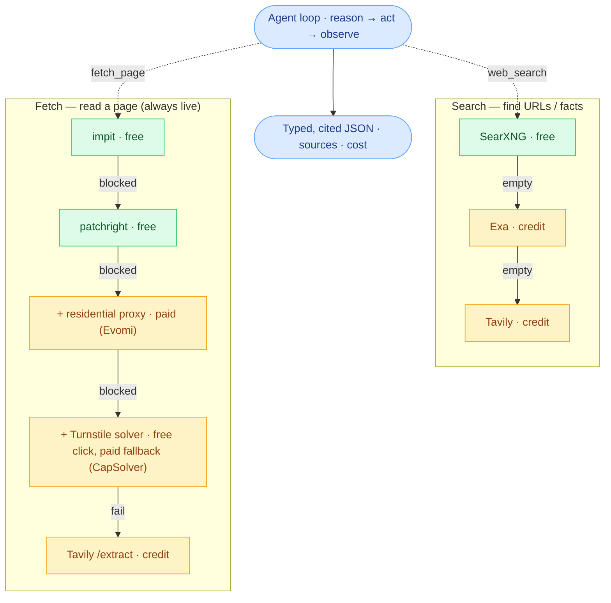

# openclaygent

A web-research agent: hand it a question and a table, it reads the live web for every row
and returns typed, **cited JSON**. The open-source take on Clay's Claygent, shipped as a
CLI and an HTTP API.

## The idea

Write the brief once — a plain-English question, the inputs, and the shape of the answer:

```jsonc
{
  "instructions": "What industry is this company in? Check their website first.",
  "template":     "Company: {{company}}\nWebsite: {{domain}}",
  "schema":       { "industry": "string", "confidence": "low|medium|high" }
}
```

Point it at a row — `{ "company": "Linear", "domain": "linear.app" }` — and it searches,
reads pages when it needs to, and returns typed, cited JSON. Run the same brief over a
500-row CSV and you get one result per row.

## How it works

The agent loops — reason, pick a tool, observe — until it can answer. Its two tools are
cheapest-first ladders: a rung runs only when the one above it fails or returns empty, and
an unset key is a skipped rung, never an error. You pay only when the free rungs miss.



Green = free, amber = paid. `RunResult.cost` meters the LLM, Exa, Apify, and Tavily; the
Evomi proxy and CapSolver fallback bill on their own accounts.

## Setup

One line from nothing:

```bash
curl -fsSL https://raw.githubusercontent.com/simonbalfe/openclaygent/main/scripts/install.sh | bash
```

It clones the repo, installs Bun and deps, creates `.env`, prompts for keys (only
OpenRouter is required), and starts the free search + fetch stack plus the API via Docker.
When it finishes: API at `http://localhost:8080/docs`, CLI available globally as
`openclaygent`.

- Already cloned? `./scripts/setup.sh`
- Manual instead: `bun install && cp .env.example .env && docker compose up -d`, then edit `.env`
- No Docker? Set `EXA_API_KEY` and skip compose — Exa searches, the built-in `impit` rung
  fetches. Zero infra, but you pay per search.

**Required:**

| Variable | What it's for | Get one |
|---|---|---|
| `OPENROUTER_API_KEY` | The model (DeepSeek default; any OpenRouter model per run) | [openrouter.ai/keys](https://openrouter.ai/keys) |

**Optional** — each key just enables its rung or tool:

| Variable | What it adds |
|---|---|
| `EXA_API_KEY` | Paid search fallback (and the no-Docker path) |
| `TAVILY_API_KEY` | Last-resort search rung + live `fetch_page` fallback |
| `APIFY_API_TOKEN` | `linkedin_*` and `crunchbase_company` enrichment tools |
| `EVOMI_*` · `CAPSOLVER_API_KEY` | Residential proxy + captcha solver for the hardest pages |
| `OPENCLAY_MODEL` | Default model id (per-run override: `--model`) |
| `OPENCLAY_DEBUG` | `1` = detailed stderr trace (rung timings, errors, cache, LLM calls) |

The full list, including per-actor overrides and cache tuning, is in `.env.example`.

## Use it: CLI

```bash
openclaygent --json \
  --instructions "Does this company offer a free trial? Check their pricing page." \
  --template "Company: {{company}}" \
  --schema '{"free_trial":"boolean","evidence_url":"string?"}' \
  --input company=Linear
# → { "result": { "free_trial": true, "evidence_url": "https://linear.app/pricing" },
#     "sources": [...], "cost": {...}, "model": "deepseek/deepseek-chat" }
```

`--json` prints clean JSON to stdout (warnings to stderr), so it pipes into scripts and
agents. Batch with `--rows leads.csv --out enriched.json`; skip unqualified rows with
`--require domain`. Full flags: `openclaygent --help`.

## Use it: HTTP API

```bash
bun run api    # :8080, interactive docs at /docs
curl -s localhost:8080/run -H 'content-type: application/json' -d '{
  "instructions": "Identify which CRM the company uses.",
  "template": "Company: {{company}} ({{domain}})",
  "schema": {"crm":"string?","confidence":"low|medium|high"},
  "rows": [{"company":"Linear","domain":"linear.app"}]
}'
```

Full request/response shape: `docs/architecture.md` (HTTP API).

## Uninstall

```bash
~/openclaygent/scripts/uninstall.sh    # or: curl -fsSL <raw>/scripts/uninstall.sh | bash
```

Removes containers, images, the global link, and the install directory; leaves your
`~/.zshrc` keys alone. Confirms first (`-y` to skip).

## Docs

- `docs/walkthrough.md` — the flow and why each step works the way it does. Start here.
- `docs/architecture.md` — the mechanism: action, loop, contract, file map.
- `docs/decisions.md` — the non-obvious choices and the conventions that bite.
- `docs/roadmap.md` — what's shipped and what's next.
