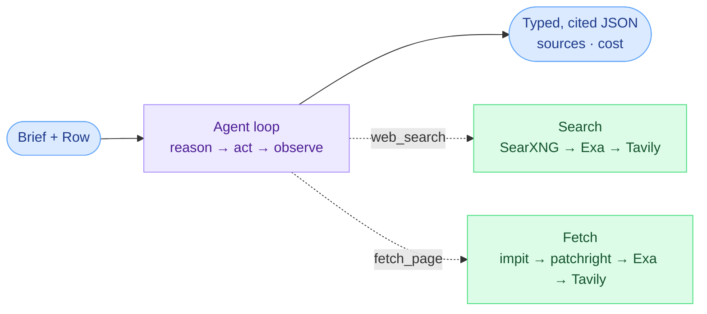

# openclaygent

A little web-research agent you hand a question and a table — it reads the live web for every
row and hands back clean, **cited JSON**.

It's the open-source take on Clay's Claygent, shipped as a **CLI and an HTTP API** so any
agent, script, or workflow can call it. Ask it the niche facts no data vendor sells — "does
this company offer a free trial?", "what CRM do they use?", "how many open engineering roles?"
— and get a typed answer with the sources to back it, one per row.

## The idea

Write the brief once: a plain-English question, the inputs it needs, and the shape of the
answer you want back.

```jsonc
{
  "instructions": "What industry is this company in? Check their website first.",
  "template":     "Company: {{company}}\nWebsite: {{domain}}",
  "schema":       { "industry": "string", "confidence": "low|medium|high" }
}
```

Point it at a row — `{ "company": "Linear", "domain": "linear.app" }` — and it searches, reads
the page if it needs to, and returns typed, cited JSON. Run the **same brief** over a 500-row
CSV and you get one result per row: the brief is fixed, the rows vary.

## How it works

The agent loops — reason, pick a tool, observe — until it can answer. Its two tools are
**waterfalls**: each tries the cheapest rung you've configured first and only falls through to
a paid one when that misses or fails. An unset key is just a skipped rung.



## Setup

```bash
bun install
cp .env.example .env    # then fill in the keys below
```

**You need two keys to start** (no Docker, no other setup):

| Variable | What it's for | Get one |
|---|---|---|
| `OPENROUTER_API_KEY` | The model brain — one key drives any model (DeepSeek, Claude, GPT, Llama) | [openrouter.ai/keys](https://openrouter.ai/keys) |
| `EXA_API_KEY` | Gives it eyes — web search **and** page fetch in one key | [dashboard.exa.ai](https://dashboard.exa.ai/api-keys) |

That's enough to run. DeepSeek is the default model (cheap); swap per run with `--model`.

> Prefer **free** search + fetch over paying Exa? Run `docker compose up -d` (starts a local
> SearXNG + a headless-browser fetch service) and set `SEARXNG_URL` + `PATCHRIGHT_URL`. Then
> `EXA_API_KEY` becomes optional — it's just the paid fallback. See `docs/architecture.md`.

**Everything else is optional** — it only changes cost, reach, or adds tools:

| Variable | Default | What it adds |
|---|---|---|
| `OPENCLAY_MODEL` | `deepseek/deepseek-chat` | Default model id (override per run with `--model`) |
| `SEARXNG_URL` | – | Free self-hosted search, tried first (from `docker compose up`) — saves Exa credits |
| `PATCHRIGHT_URL` | – | Free headless-browser fetch for JS-heavy / bot-walled pages (from `docker compose up`) |
| `TAVILY_API_KEY` | – | Last-resort search + page extract when SearXNG and Exa both miss |
| `TAVILY_USD_PER_CREDIT` | `0.008` | Tunes the cost report to your Tavily plan |
| `APIFY_API_TOKEN` | – | Enables the `linkedin_*` tools (profiles, posts, company data) |
| `PORT` | `8080` | Port for the HTTP API (`bun run api`) |
| `EVOMI_*` · `CAPSOLVER_API_KEY` | – | Residential proxy + captcha solver for the toughest anti-bot pages |

The search and fetch ladders try the cheapest rung you've configured first and only fall
through to a paid one when it's unset or fails — so an unset key is simply a skipped rung,
never an error.

## Use it: CLI

The CLI is the quickest way in. With `--json` it prints a clean result to stdout (warnings go
to stderr), so it pipes straight into whatever you're building — a shell script, a cron job,
or an agent that shells out for a typed, cited answer instead of researching inline.

```bash
bun run cli -- --json \
  --instructions "Does this company offer a free trial? Check their pricing page." \
  --template "Company: {{company}}" \
  --schema '{"free_trial":"boolean","evidence_url":"string?"}' \
  --input company=Linear
# → { "result": { "free_trial": true, "evidence_url": "https://linear.app/pricing" },
#     "sources": [...], "cost": {...}, "model": "deepseek/deepseek-chat" }
```

Batch a list with `--rows leads.csv --out enriched.json`, and skip rows that don't qualify
with `--require domain` before a token is spent. Full flags: `bun run cli -- --help`.

## Use it: HTTP API

The same engine over the wire, so any service or workflow can call it. `bun run api` serves
`POST /run`, with interactive docs at `/docs`.

```bash
bun run api    # :8080
curl -s localhost:8080/run -H 'content-type: application/json' -d '{
  "instructions": "Identify which CRM the company uses.",
  "template": "Company: {{company}} ({{domain}})",
  "schema": {"crm":"string?","confidence":"low|medium|high"},
  "rows": [{"company":"Linear","domain":"linear.app"}]
}'
```

See `docs/architecture.md` (HTTP API) for the full request/response shape.

## Docs

- `docs/architecture.md` — how it works: the action, the loop, the contract, the file map.
- `docs/decisions.md` — the non-obvious choices and the conventions that bite.
- `docs/roadmap.md` — what's shipped and what's next.
