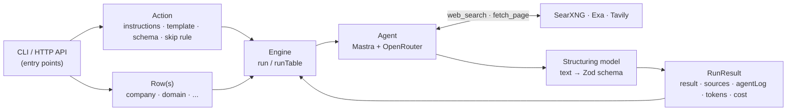
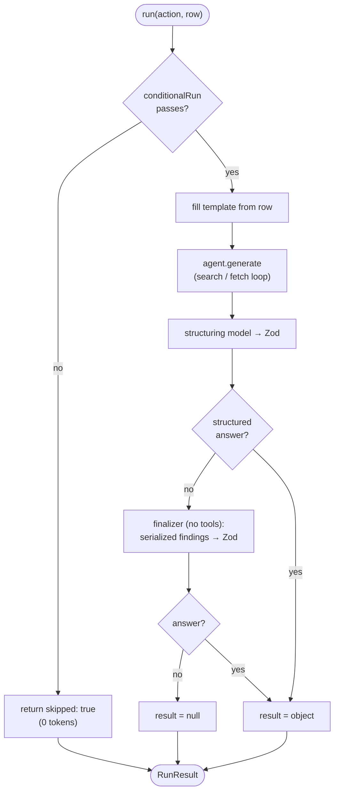
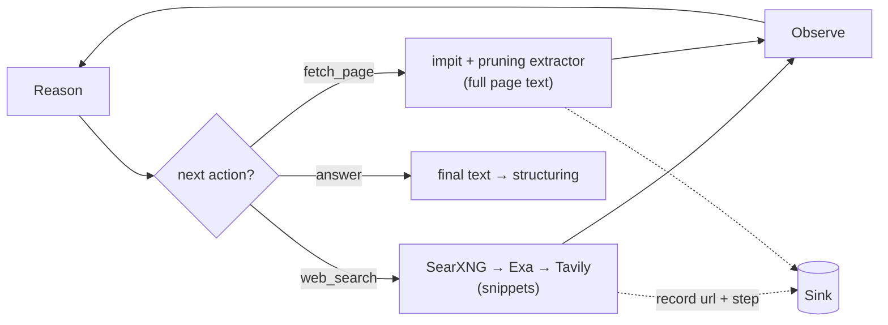

# Architecture

openclaygent turns a natural-language research brief plus an output schema into a
typed, cited JSON answer for each row of a table, by researching the live web.

## Flow at a glance

The action is fixed, the rows vary. An entry point builds the action, the engine runs it
against each row, the agent does the web research, a structuring pass shapes the answer.



## One row through `run`

Each row passes the skip gate, gets its template filled, runs the agent loop, and is
shaped into the schema — with a tools-disabled finalization pass if the loop ends without
a structured answer (the common reasoning-model failure: the step budget runs out
mid-tool-call and no final text is ever produced).



## Inside the agent loop

The model decides each step: search the web, optionally read a page, then answer. Tools
write every URL and step into the run's `Sink`.



## The unit: an action

An **action** (`src/core/types.ts`, `Action<S>`) is a reusable research brief. It mirrors
Clay's `use-ai` action from the catalog. Four parts:

| Field | Role |
|---|---|
| `name` | stable id, e.g. `free_trial_check` |
| `instructions` | system prompt: the persona + the task |
| `template` | user prompt with `{{field}}` slots filled from the row |
| `output` | Zod schema the final answer must match (the submit-answer shape) |
| `conditionalRun?` | predicate on the row; return false to skip the row before spending a token |

One action runs against many rows. That is the per-row enrichment shape: the brief is
fixed, the row varies.

## The loop

`run(action, row, opts)` in `src/core/engine.ts` is the core unit. Flow:

1. **Conditional gate** — if `conditionalRun` returns false, return immediately with
   `skipped: true`, zero tokens. This is Clay's #1 credit saver.
2. **Template fill** — `{{field}}` slots are replaced from the row; missing fields are
   marked `[MISSING:field]` and warned, not failed.
3. **Agent loop** — a fresh Mastra agent (`src/core/agent.ts`) runs with two tools and the
   tuned research behaviour, looping reason → tool → observe until it answers. The system
   context stacks three layers, fixed-first so prompt caching holds across rows: the
   research doctrine (`BEHAVIOUR` in `src/core/agent.ts` — search/navigation/evidence/answer
   discipline, our equivalent of Claygent's hidden tuned system prompt), then the action's
   `instructions`, then the templated row task. Doctrine rules lose to action rules on
   conflict.
4. **Structure** — a separate structuring model shapes the final text into the action's
   Zod schema (see `decisions.md` for why it must be separate).
5. **Finalization fallback** — if the loop returns no structured answer (a reasoning model
   exhausting its step budget mid-tool-call is the usual cause), a separate tools-disabled
   finalizer (`buildFinalizer`, `src/core/agent.ts`) is handed the serialized findings from
   the run's `Sink` and forced to emit the schema from those alone. See `decisions.md`.
6. **Return the contract** — `RunResult<S>`: `result`, `sources`, `agentLog`, `tokens`,
   `cost`, `durationMs`, `model`.

`runTable(action, rows, opts)` runs the loop across a whole table, returning one
`RunResult` per row. Rows run concurrently through a fixed-size worker pool —
`opts.concurrency` workers (default 5) pull from a shared cursor, so at most N rows are
in flight at once while results stay in row order. Each row is isolated: a row whose `run`
throws (provider error, etc.) returns a failed `RunResult` (`result: null`, `error` set)
rather than rejecting the whole batch, so one bad row never discards the others.

## The tools

`src/tools/web.ts` builds two tools **per run**, bound to a `Sink` so every URL and step
is recorded without global state:

- `web_search(query)` — a cheapest-first provider ladder: self-hosted SearXNG
  (`SEARXNG_URL`, zero-cost) → Exa (`EXA_API_KEY`, /search with inline contents) →
  Tavily (`TAVILY_API_KEY`). A rung is skipped when its env is unset and the ladder
  escalates when a rung throws or returns zero results; the winning rung is recorded as
  `via` on the step. Returns title/url/snippet. Snippets are usually enough to answer.
- `fetch_page(urls)` — impit (browser-TLS HTTP) + the extractor
  (`src/tools/extract.ts`: JSON-LD/meta structured data prepended, then Readability-first with a
  Crawl4AI prune fallback — see decisions.md) renders the page as markdown for free; PDFs are
  parsed to text via `unpdf`. When
  the result looks like a JS shell or block page it escalates to the **patchright** compose
  service (`PATCHRIGHT_URL`, real rendered Chrome — see decisions.md), recorded as
  `via: patchright` in the step. When every self-hosted rung fails, one paid rung runs last —
  **Tavily `/extract`** (`via: tavily`, official SDK), an always-live managed fetch. Exa
  `/contents` is deliberately **not** a fetch rung: it is cache-first, which conflicts with
  the live-data priority (see decisions.md, Fetch ladder). Capped at a bounded read window.
  Only used when snippets are insufficient.

Long pages are reduced, not blind-truncated: `fetch_page` takes an optional `query`, and when
the cleaned markdown exceeds the cap, `fitToBudget` (`extract.ts`) chunks it and keeps the
**BM25-top sections** for that query (lexical relevance, local, $0) instead of the first N
chars. It only fires over-cap; small pages pass through whole; with no query it falls back to
head-truncation. See decisions.md (Large pages).

Cheapest-first: the agent is told to prefer search snippets and only fetch when it needs a
specific page's full text. Full verbatim examples of what `fetch_page` returns live in
`docs/examples/` (an index page and a long case-study page, captured live).

Every tool that opens a URL (`fetch_page`, the `linkedin_*` tools, `crunchbase_company`)
refuses URLs the model invented: a URL must have come from a `web_search` result, this row's
input, or a link on a page already fetched. See decisions.md (No fabricated URLs) for the
`sink.seen` / `assertVerifiedUrl` mechanism.

## The contract

Every run returns `RunResult<S>` (`src/core/types.ts`):

- `result` — the schema-shaped answer, or null (null when skipped, when both the agent
  loop and the finalization fallback failed to produce structured output, or when the row
  threw — in which case `error` carries the message).
- `sources` — every URL the tools touched.
- `agentLog` — ordered `AgentStep[]`, the replay log of search/fetch/answer steps. Each
  step carries `results: StepResult[]` — what the tool actually returned (title, URL,
  preview snippet, fetched char count) — and `cost` (USD for that paid tool step) — so a
  run is auditable after the fact.
- `cost` — `RunCost`: exact spend for the run, `{ total, llm, tools, byProvider, tavilyCredits }`,
  all real provider figures (never estimated). Mechanism in `decisions.md` (Cost accounting).
- `tokens`, `durationMs`, `model` — usage and provenance.
- `skipped?` / `error?` — set when the row was skipped by `conditionalRun`, or when its
  `run` threw and `runTable` caught it (the batch keeps going). Both absent on a normal run.

## File map

| File | Role |
|---|---|
| `src/core/types.ts` | `Action` primitive, `RunResult` contract, `defineAction` helper |
| `src/tools/web.ts` | thin assembler — `webTools(sink, cache)` returns `web_search` + `fetch_page` from `search.ts` and `fetch.ts` |
| `src/tools/search.ts` | `web_search` tool + `searchWeb` (SearXNG→Exa→Tavily ladder) |
| `src/tools/fetch.ts` | `fetch_page` tool (impit→patchright→Tavily /extract ladder), `usable` shell-page guard, `fetchLadder` outcome classification (`ok`/`dead`/`transient`, `isDeadStatus`) for status-aware negative caching |
| `src/tools/providers.ts` | shared external clients: the `impit` instance, lazy `exaClient`, lazy `tavilyClient` |
| `src/tools/sink.ts` | the per-run `Sink` (sources, `seen` URL-provenance set, agent log, cost, `onStep`) + `record`/`clip`/`noteUrl`/`assertVerifiedUrl` helpers, shared by every tool |
| `src/tools/extract.ts` | HTML→markdown: `extractStructuredData` (JSON-LD + meta, prepended) then Readability-first (article/blog) → Crawl4AI-prune fallback (structured pages) → Turndown GFM (leftover non-data tables flattened) |
| `src/tools/apify.ts` | shared `runActor` — Apify start→poll→read-dataset helper (+ `usageTotalUsd` cost), used by the LinkedIn and Crunchbase tools |
| `src/tools/linkedin.ts` | `linkedin_profile` / `linkedin_posts` / `linkedin_post_reactions` / `linkedin_find_people` / `linkedin_company` (Apify HarvestAPI actors; registered only when `APIFY_API_TOKEN` is set) |
| `src/tools/crunchbase.ts` | `crunchbase_company` — **fallback-only** Crunchbase funding/firmographics via an Apify actor (`CRUNCHBASE_ACTOR`, default `parseforge~crunchbase-scraper`); registered only when `APIFY_API_TOKEN` is set |
| `src/core/agent.ts` | per-run cost-tapped OpenRouter provider (`buildOpenRouter`), default model, research behaviour, `buildAgent`, tools-disabled `buildFinalizer` |
| `src/core/cost.ts` | `CostAccumulator` + `emptyCost`, Tavily credit→USD rate, `extractCostUsd` (reads `usage.cost` from JSON or SSE OpenRouter responses) |
| `src/core/cache.ts` | `createCache(l2?)` / `Cache` / `Layer2` — single-flight L1 in-memory cache (`getOrCompute(ns, key, fn, opts)`) shared across a `runTable`, with an optional pluggable L2; backs search + fetch result reuse. See `decisions.md` (Per-table cache) |
| `src/core/cache-pg.ts` | `createCacheFromEnv` — wires the L2 Postgres backend (Drizzle over `drizzle-orm/bun-sql`, typed `openclay_cache` table, auto-created on first use) when `OPENCLAY_CACHE_URL` is set, else returns the L1-only cache. Best-effort: DB errors degrade to a miss, never raise into a run |
| `src/core/engine.ts` | `run` (one row), `runTable` (a table), template fill, conditional gate, finalization fallback (`serializeFindings` + `buildFinalizer`), `RunCost` assembly; `runTable` owns one `Cache` and threads it through every `run` → `buildAgent` → web tools |
| `src/core/action.ts` | `ActionSpec` (the serialized brief: instructions · template · schema) + `buildAction` — the adapter both frontends call so neither duplicates action assembly |
| `src/core/schema.ts` | `buildSchema` — turn a JSON Schema / short form into the action's Zod `output` |
| `src/cli.ts` | CLI entry: wire args → `buildAction` → rows → `runTable` → render |
| `src/cli/args.ts` | `parseArgs`, `Flags`/`Parsed` types, `HELP` text |
| `src/cli/input.ts` | `parseCSV`, `loadRows`, `loadActionSpec`, `buildOptions` — flags/files → `ActionSpec` + rows + `RunOptions` |
| `src/cli/render.ts` | `formatStep`, `money`, `costBreakdown`, `printRow` — terminal presentation |
| `src/api.ts` | HTTP entry: `@hono/zod-openapi` `POST /run` → `buildAction` → `runTable`, plus `/openapi.json` + Scalar `/docs` + `/health` |
| `tests/` | `bun test` suite: schema building, skip path, template fill, extractor, search ladder, cache (single-flight, L1/L2 miss/hit, TTL-by-value), status mapping (`isDeadStatus`), tool-level cache E2E (no agent: dedup, 404 short-circuit + negative cache, transient not persisted), cache benchmark (measured call-count + wall-clock, cache-on vs cache-off); opt-in: live agent via `RUN_LIVE`, real-Postgres L2 via `OPENCLAY_CACHE_URL` |

## CLI

`src/cli.ts` is the command-line front end. It builds an `Action` from flags (or an
`--action` file), loads rows (a single `--input` row, or a `--rows` JSON/CSV batch), runs
`runTable`, and prints results.

Single row:

```bash
bun run cli -- \
  --instructions "What industry is this company in? Check their website." \
  --template "Company: {{company}}\nWebsite: {{domain}}" \
  --schema '{"industry":"string","confidence":"low|medium|high"}' \
  --input company=Linear --input domain=linear.app
```

Batch from CSV (header row supplies the `{{slots}}`), skipping rows missing a field:

```bash
bun run cli -- \
  --instructions "What industry is this company in?" \
  --template "Company: {{company}}\nWebsite: {{domain}}" \
  --schema '{"industry":"string","confidence":"low|medium|high"}' \
  --require domain --rows rows.csv
```

`--schema` accepts **standard JSON Schema** (the conventional interchange — converted to
Zod at the boundary via `zod-from-json-schema`) **or** a short form for flat outputs:
`string` | `number` | `boolean` | `a|b|c` (enum) | trailing `?` for nullable. `src/core/schema.ts`
detects which (a real JSON Schema has `type:"object"`/`properties`) and routes accordingly;
either way the engine receives a Zod schema. `--json` prints raw JSON; `--out <file>` writes
results to disk; `--model <id>` overrides the model per run; `--max-steps <n>` caps the agent
loop iterations (default 5); `--concurrency <n>` sets how many rows run in parallel
(default 5, wired as `RunOptions.concurrency`); `--verbose` streams agent steps
live as they happen with result previews — search hits (title, URL, snippet), fetched page
sizes and text previews (wired as `RunOptions.onStep`, fired by the same `record()` that
appends to `agentLog`; goes to stderr under `--json` so stdout stays pipeable).

## HTTP API

`src/api.ts` is the second front end — the same engine over HTTP, so openclaygent deploys as
a Ferret-style endpoint as well as a CLI. It shares **all** logic with the CLI: both call
`buildAction` (`core/action.ts`) then `runTable`. The API file is pure HTTP wiring — no
research, schema, or cost logic is re-implemented.

Built on `@hono/zod-openapi`: the request/response shapes are zod schemas, so the body is
**validated automatically** (a malformed body returns `400` before the handler runs) and the
**OpenAPI spec is generated from those same schemas** — one source of truth, no hand-written
spec to drift.

Routes:

- `POST /run` — body is an `ActionSpec` (`instructions` · `template` · `schema`) plus rows
  (`rows` for a batch, or `input` for one) and options (`model`, `maxSteps`, `concurrency`,
  `require`). Returns `{ results: RunResult[] }` — one element per row.
- `GET /openapi.json` — the generated OpenAPI 3 document.
- `GET /docs` — Scalar API reference over that document (same renderer as creatorcrawl).
- `GET /health` — liveness check.

Port is `PORT` (default 8080). No auth — front it with whatever the deploy provides if you
expose it publicly (it spends LLM credits per call).

```bash
bun run api        # serve on :8080  (bun run api:dev to watch)

curl -s localhost:8080/run -H 'content-type: application/json' -d '{
  "instructions": "Identify which CRM the company uses.",
  "template": "Company: {{company}} ({{domain}})",
  "schema": {"crm":"string?","confidence":"low|medium|high"},
  "rows": [{"company":"Linear","domain":"linear.app"}]
}'
```

The `schema` field takes the same JSON-Schema-or-short-form as the CLI's `--schema` (both go
through `core/schema.ts`).

## Driving it from an agent

The primary use is as a research primitive any agent or script reaches for, via the CLI's
`--json` mode or `POST /run`, rather than researching inline. Three reasons it is worth
shelling out instead:

- **Context stays clean.** A 500-row run's search and fetch traffic never enters the agent's
  conversation. Each call is isolated; only the compact `RunResult` comes back.
- **Cited and typed.** The agent gets `result` plus `sources` it can trust and quote, not a
  prose answer it has to re-parse.
- **Cheap model on the grunt work.** The research loop runs on DeepSeek (or whatever `--model`
  is set to) while the calling agent stays on its own model — bring-your-own keys, no Clay
  credit margin.

## Scope

This is the single action loop, exposed as a CLI and an HTTP API — about 80% of Claygent's
value. The cheapest-first provider **ladders** for search and fetch are built (see The tools);
what is deliberately not built is the catalog's composable primitives: `waterfall` (user-ranked
providers per action, distinct from the internal search/fetch ladders), `recipe` (multi-step
chains), model-tiers, and batch-over-Neon. The vault note `projects/claygent_clone/` holds the
full architecture these extend toward.
