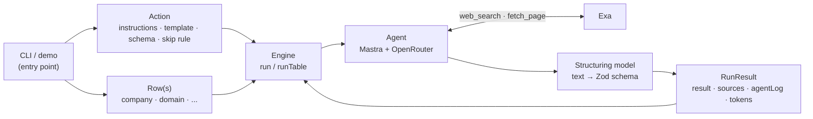
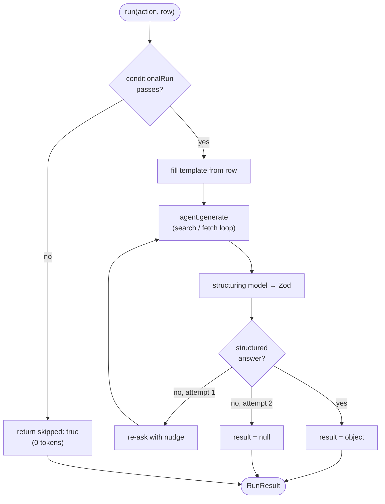
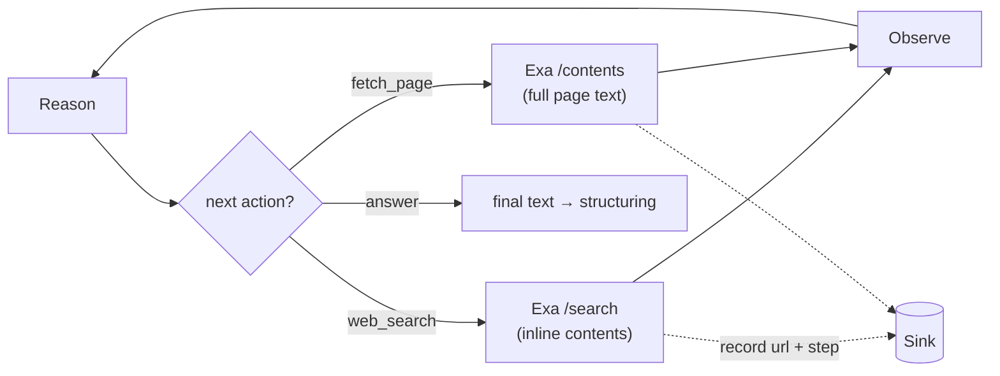

# Architecture

openclaygent turns a natural-language research brief plus an output schema into a
typed, cited JSON answer for each row of a table, by researching the live web.

## Flow at a glance

The action is fixed, the rows vary. An entry point builds the action, the engine runs it
against each row, the agent does the web research, a structuring pass shapes the answer.



## One row through `run`

Each row passes the skip gate, gets its template filled, runs the agent loop, and is
shaped into the schema — with one repair retry if the structured answer comes back empty.



## Inside the agent loop

The model decides each step: search the web, optionally read a page, then answer. Tools
write every URL and step into the run's `Sink`.



## The unit: an action

An **action** (`src/types.ts`, `Action<S>`) is a reusable research brief. It mirrors
Clay's `use-ai` action from the catalog. Four parts:

| Field | Role |
|---|---|
| `name` | stable id, e.g. `free_trial_check` |
| `instructions` | system prompt: the persona + the task |
| `template` | user prompt with `{{field}}` slots filled from the row |
| `output` | Zod schema the final answer must match (the submit-answer shape) |
| `conditionalRun?` | predicate on the row; return false to skip the row before spending a token |

One action runs against many rows. That is the per-row enrichment shape: the brief is
fixed, the row varies.

## The loop

`run(action, row, opts)` in `src/engine.ts` is the core unit. Flow:

1. **Conditional gate** — if `conditionalRun` returns false, return immediately with
   `skipped: true`, zero tokens. This is Clay's #1 credit saver.
2. **Template fill** — `{{field}}` slots are replaced from the row; missing fields are
   marked `[MISSING:field]` and warned, not failed.
3. **Agent loop** — a fresh Mastra agent (`src/agent.ts`) runs with two tools and the
   tuned research behaviour, looping reason → tool → observe until it answers.
4. **Structure** — a separate structuring model shapes the final text into the action's
   Zod schema (see `decisions.md` for why it must be separate).
5. **Repair retry** — if the structured answer is null, re-ask once with a nudge. See
   `decisions.md`.
6. **Return the contract** — `RunResult<S>`: `result`, `sources`, `agentLog`, `tokens`,
   `durationMs`, `model`.

`runTable(action, rows, opts)` runs the loop across a whole table, returning one
`RunResult` per row.

## The tools

`src/tools/web.ts` builds two tools **per run**, bound to a `Sink` so every URL and step
is recorded without global state:

- `web_search(query)` — Exa search (/search with inline contents). Returns title/url/snippet. Snippets are usually
  enough to answer.
- `fetch_page(urls)` — Exa contents. Full cleaned page text, capped at a bounded read
  window. Only used when snippets are insufficient.

Cheapest-first: the agent is told to prefer search snippets and only fetch when it needs a
specific page's full text.

## The contract

Every run returns `RunResult<S>` (`src/types.ts`):

- `result` — the schema-shaped answer, or null (null when skipped, or when both attempts
  failed to produce structured output).
- `sources` — every URL the tools touched.
- `agentLog` — ordered `AgentStep[]`, the replay log of search/fetch/answer steps.
- `tokens`, `durationMs`, `model` — cost and provenance.

## File map

| File | Role |
|---|---|
| `src/types.ts` | `Action` primitive, `RunResult` contract, `defineAction` helper |
| `src/tools/web.ts` | `web_search` + `fetch_page` (Exa), the per-run `Sink` |
| `src/agent.ts` | OpenRouter provider, default model, research behaviour, `buildAgent` |
| `src/engine.ts` | `run` (one row), `runTable` (a table), template fill, conditional gate, repair retry |
| `src/cli.ts` | CLI front end: parse args, build the action, load rows, print results |
| `src/schema.ts` | `jsonToZod` — turn a CLI JSON shape into the action's Zod `output` |
| `src/index.ts` | runnable demo: enrich 3 company rows into a free-trial column |

## CLI

`src/cli.ts` is the command-line front end. It builds an `Action` from flags (or an
`--action` file), loads rows (a single `--input` row, or a `--rows` JSON/CSV batch), runs
`runTable`, and prints results.

Single row:

```bash
bun run cli -- \
  --instructions "What industry is this company in? Check their website." \
  --template "Company: {{company}}\nWebsite: {{domain}}" \
  --schema '{"industry":"string","confidence":"low|medium|high"}' \
  --input company=Linear --input domain=linear.app
```

Batch from CSV (header row supplies the `{{slots}}`), skipping rows missing a field:

```bash
bun run cli -- \
  --instructions "What industry is this company in?" \
  --template "Company: {{company}}\nWebsite: {{domain}}" \
  --schema '{"industry":"string","confidence":"low|medium|high"}' \
  --require domain --rows rows.csv
```

Schema field syntax (`jsonToZod`): `string` | `number` | `boolean` | `a|b|c` (enum) |
trailing `?` for nullable (e.g. `string?`). `--json` prints raw JSON; `--out <file>`
writes results to disk; `--model <id>` overrides the model per run.

## Scope

This is the single action loop only — about 80% of Claygent's value. Deliberately not
built: waterfall (ranked-provider fallback), recipe (multi-step chains), model-tiers,
batch-over-Neon. The vault note `projects/claygent_clone/` holds the full architecture
these extend toward.
