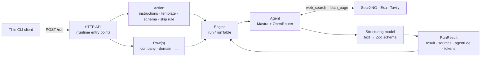
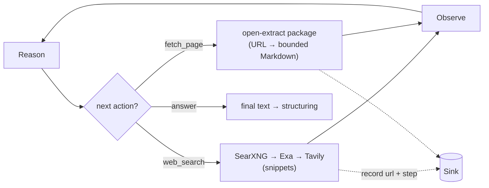

# Architecture

openclaygent turns a natural-language research brief plus an output schema into a
typed, cited JSON answer for each row of a table, by researching the live web.

## Flow at a glance

The action is fixed, the rows vary. The CLI sends requests to the HTTP API, the API builds
the action, the engine runs it against each row, and a structuring pass shapes the answer.

## One row through `run`

Each row passes the skip gate, gets its template filled, runs the agent loop, and is
shaped into the schema — with a tools-disabled finalization pass if the loop ends without
a structured answer (the common reasoning-model failure: the step budget runs out
mid-tool-call and no final text is ever produced).

## Inside the agent loop

The model decides each step: search the web, optionally read a page, then answer. Tools
write every URL and step into the run's `Sink`.

## The unit: an action

An **action** (`src/api/core/types.ts`, `Action<S>`) is a reusable research brief. It mirrors
Clay's `use-ai` action from the catalog. Five parts:

| Field | Role |
|---|---|
| `name` | stable id, e.g. `free_trial_check` |
| `instructions` | system prompt: the persona + the task |
| `template` | user prompt with `{{field}}` slots filled from the row |
| `output` | Zod schema the final answer must match (the submit-answer shape) |
| `conditionalRun?` | predicate on the row; return false to skip the row before spending a token |

One action runs against many rows. That is the per-row enrichment shape: the brief is
fixed, the row varies.

## The loop

`run(action, row, opts)` in `src/api/core/engine.ts` is the core unit. Flow:

1. **Conditional gate** — if `conditionalRun` returns false, return immediately with
   `skipped: true`, zero tokens. This is Clay's #1 credit saver.
2. **Template fill** — `{{field}}` slots are replaced from the row; missing fields are
   marked `[MISSING:field]` and warned, not failed.
3. **Agent loop** — a fresh Mastra agent (`src/api/agent/index.ts`) runs with two web tools plus
   optional LinkedIn and Crunchbase enrichment tools when `APIFY_API_TOKEN` is set, and the
   tuned research behaviour, looping reason → tool → observe until it answers. The system
   context stacks three layers, fixed-first for stable prompts across rows: the
   research doctrine (`RESEARCH_SYSTEM_PROMPT` in `src/api/agent/prompts.ts` — search/navigation/evidence/answer
   discipline, our equivalent of Claygent's hidden tuned system prompt), then the action's
   `instructions`, then the templated row task. Doctrine rules lose to action rules on
   conflict.
4. **Structure** — a separate structuring model shapes the final text into the action's
   Zod schema (see `decisions.md` for why it must be separate).
5. **Finalization fallback** — if the loop returns no structured answer (a reasoning model
   exhausting its step budget mid-tool-call is the usual cause), a separate tools-disabled
   finalizer (`buildFinalizer`, `src/api/agent/index.ts`) is handed the serialized findings from
   the run's `Sink` and forced to emit the schema from those alone. See `decisions.md`.
6. **Return the contract** — `RunResult<S>`: `result`, `sources`, `agentLog`, `tokens`,
   `durationMs`, `model`.

`runTable(action, rows, opts)` runs the loop across a whole table, returning one
`RunResult` per row. Rows run concurrently through a fixed-size worker pool —
`opts.concurrency` workers (default 5) pull from a shared cursor, so at most N rows are
in flight at once while results stay in row order. Each row is isolated: a row whose `run`
throws (provider error, etc.) returns a failed `RunResult` (`result: null`, `error` set)
rather than rejecting the whole batch, so one bad row never discards the others.

## The tools

`src/api/agent/tools/web.ts` builds two tools **per run**, bound to a `Sink` so every URL and step
is recorded without global state:

- `web_search(query)` — a thin adapter around the framework-agnostic `packages/open-search`
  workspace package. The package owns a cheapest-first provider ladder: self-hosted SearXNG
  (`SEARXNG_URL`, zero-cost; routes its engine scrapes through the Evomi residential proxy
  so they are not CAPTCHA-blocked — see decisions.md, Search ladder) → Exa (`EXA_API_KEY`,
  /search with inline contents) → Tavily (`TAVILY_API_KEY`). A rung is skipped when its env
  is unset and the ladder escalates when a rung throws or returns zero results; the winning
  rung is recorded as `via` on the step. Returns title/url/snippet. Snippets are usually
  enough to answer.
- `fetch_page(urls)` — a thin Openclaygent adapter around the framework-agnostic
  `packages/open-extract` workspace package. The package accepts one
  URL and owns impit HTTP retrieval, Patchright direct/proxy/solver escalation, optional Tavily
  fallback, HTML/PDF detection, JSON-LD/meta extraction, Readability/pruning, Markdown conversion,
  and the bounded read window. Openclaygent retains URL provenance, evidence capture,
  and agent-step recording around the imported `extract(url)` call. Only used when snippets are
  insufficient.

Cheapest-first: the agent is told to prefer search snippets and only fetch when it needs a
specific page's full text.

Every tool that opens a URL (`fetch_page`, the `linkedin_*` tools, `crunchbase_company`)
refuses URLs the model invented: a URL must have come from a `web_search` result, this row's
input, or a link on a page already fetched. See decisions.md (No fabricated URLs) for the
`sink.seen` / `assertVerifiedUrl` mechanism.

## The contract

Every run returns `RunResult<S>` (`src/api/core/types.ts`):

- `result` — the schema-shaped answer, or null (null when skipped, when both the agent
  loop and the finalization fallback failed to produce structured output, or when the row
  threw — in which case `error` carries the message).
- `runId` — a stable identifier for correlating concurrent debug output, traces, and errors.
- `reasoning` — one or two model-written sentences on which sources settled the answer
  (the structuring pass wraps the action's schema as `{ answer, reasoning }`, so it is
  grounded in the same findings; null whenever `result` is null).
- `sources` — every URL the tools touched.
- `agentLog` — ordered `AgentStep[]`, the replay log of search/fetch/answer steps. Each
  step carries `results: StepResult[]` — what the tool actually returned (title, URL,
  preview snippet, fetched char count), and a `trail` of every ladder rung attempted with the reason it escalated (search: on the
  step; fetch: per-URL on each result) — so a run is auditable after the fact and the
  cheapest-first waterfall is visible in the completed `agentLog`.
- internal evidence — `RunContext` retains the full bounded text returned by each tool,
  separately from the concise `agentLog` previews. The finalizer reads this evidence while
  the HTTP response remains compact.
- `tokens`, `durationMs`, `model` — usage and provenance.
- `skipped?` / `error?` — set when the row was skipped by `conditionalRun`, or when its
  `run` threw and `runTable` caught it (the batch keeps going). Both absent on a normal run.

## File map

| File | Role |
|---|---|
| `src/api/core/types.ts` | `Action` primitive, `RunResult` contract, `defineAction` helper |
| `src/api/agent/tools/web.ts` | thin assembler — `webTools(context)` returns `web_search` + `fetch_page` from `search.ts` and `fetch.ts` |
| `src/api/agent/tools/search.ts` | thin `web_search` adapter: `open-search.search(query)` → evidence and step recording |
| `src/api/agent/tools/fetch.ts` | thin `fetch_page` adapter: URL guard → `open-extract.extract(url)` → evidence and step recording |
| `packages/open-search/` | isolated Bun/TypeScript workspace package: SearXNG→Exa→Tavily ladder, diagnostics, standalone CLI, and SearXNG service configuration |
| `packages/open-extract/` | isolated Bun/TypeScript workspace package: URL retrieval ladder, HTML/PDF extraction, bounded Markdown, Patchright service, and standalone CLI |
| `packages/open-apify/` | isolated actor runner: start, poll, timeout, dataset retrieval, and run metadata; no Mastra or Openclaygent runtime dependency |
| `src/api/agent/sink.ts` | the per-run context (sources, `seen` URL-provenance set, agent log, `onStep`) + shared recording and URL-provenance helpers |
| `src/api/agent/tools/apify.ts` | Mastra/provenance adapter around `open-apify`, shared by the LinkedIn and Crunchbase tools |
| `src/api/agent/tools/linkedin/` | one explicit Mastra tool per file for `linkedin_profile` / `linkedin_posts` / `linkedin_post_reactions` / `linkedin_find_people` / `linkedin_company`, plus shared actor response schemas; registered only when `APIFY_API_TOKEN` is set |
| `src/api/agent/tools/crunchbase.ts` | `crunchbase_company` — **fallback-only** Crunchbase funding/firmographics via an Apify actor (`CRUNCHBASE_ACTOR`, default `parseforge~crunchbase-scraper`); registered only when `APIFY_API_TOKEN` is set |
| `src/api/agent/index.ts` | per-run OpenRouter provider, default model, tool registration, `buildAgent`, and tools-disabled `buildFinalizer` |
| `src/api/agent/prompts.ts` | research and tools-disabled finalizer system prompts |
| `src/api/core/debug.ts` | `debug(scope, message)` + `reason(e)` — API stderr trace lines gated on `OPENCLAY_DEBUG`; covers adapter outcomes, Apify status, LLM calls, and engine pass boundaries. The standalone packages expose their own `--debug` flags. |
| `src/api/core/engine.ts` | `run` (one row), `runTable` (a table), template fill, conditional gate, and finalization fallback (`serializeFindings` + `buildFinalizer`) |
| `src/api/core/action.ts` | `ActionSpec` (the serialized brief: instructions · template · schema) + `buildAction`, owned by the API runtime |
| `src/api/http.ts` | public validated `POST /run` request and response contract used by the API and thin CLI client; independent of runtime core and agent code |
| `src/api/core/schema.ts` | `buildSchema` — turn a JSON Schema / short form into the action's Zod `output` |
| `src/cli/` | thin top-level CLI application: `index.ts` entry plus flags, local input, HTTP client, and rendering; never imports the engine |
| `src/api/` | HTTP application and complete Claygent runtime: contract, core flow, agent, tools, and HTTP composition |

## CLI boundary

`src/cli/index.ts` loads local flags and files, sends the shared request to `POST /run`,
validates the response, and renders it. Research always runs in the API. The CLI never imports
the engine or agent.

CLI procedures, schema formats, output modes, and batch examples live in `usage-guide.md`.

## HTTP API

`src/api/index.ts` is the sole engine entry point. It validates the HTTP request, calls
`buildAction` (`core/action.ts`) and `runTable`, and returns the results. The CLI reaches this
same path over HTTP rather than carrying a second copy of the runtime.

Built on `@hono/zod-openapi`: the request/response shapes are zod schemas, so the body is
**validated automatically** (a malformed body returns `400` before the handler runs) and the
**OpenAPI spec is generated from those same schemas** — one source of truth, no hand-written
spec to drift.

Routes:

- `POST /run` — body is an `ActionSpec` (`instructions` · `template` · `schema`) plus rows
  (`rows` for a batch, or `input` for one) and options (`model`, `maxSteps`, `concurrency`,
  `require`). Returns `{ results: RunResult[] }` — one element per row.
- `GET /openapi.json` — the generated OpenAPI 3 document.
- `GET /docs` — Scalar API reference over that document (same renderer as creatorcrawl).
- `GET /health` — liveness check.

Port is `PORT` (default 8080). No auth — front it with whatever the deploy provides if you
expose it publicly (it spends LLM credits per call). `docker compose up -d --wait` runs the API as the
`api` service from the public `ghcr.io/simonbalfe/openclaygent` image. Compose pulls separate
public SearXNG and Patchright images, loads `.env`, and waits for all three service health checks;
`bun run api` is the local-development alternative.

The `schema` field takes the same JSON-Schema-or-short-form as the CLI's `--schema` (both go
through `core/schema.ts`). API procedures and request examples live in `usage-guide.md`.

## Driving it from an agent

The primary use is as a research primitive any agent or script reaches for, via the CLI's
`--json` mode or `POST /run`, rather than researching inline. Three reasons it is worth
shelling out instead:

- **Context stays clean.** A 500-row run's search and fetch traffic never enters the agent's
  conversation. Each call is isolated; only the compact `RunResult` comes back.
- **Cited and typed.** The agent gets `result` plus `sources` it can trust and quote, not a
  prose answer it has to re-parse.
- **Cheap model on the grunt work.** The research loop runs on Gemini Flash Lite by default (or whatever `--model`
  is set to) while the calling agent stays on its own model — bring-your-own keys, no Clay
  credit margin.

## Scope

Openclaygent currently provides one reusable action loop through an HTTP API and CLI client.
Remaining capabilities and planned work live in `roadmap.md`.
